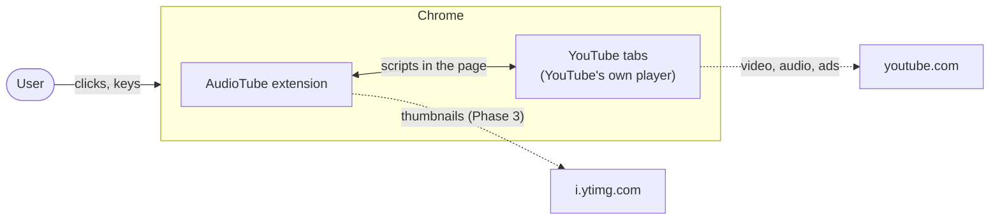
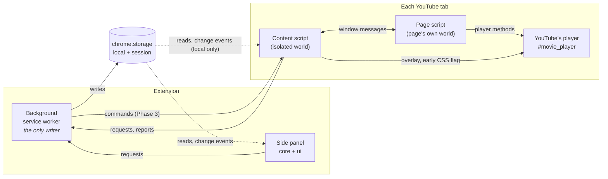
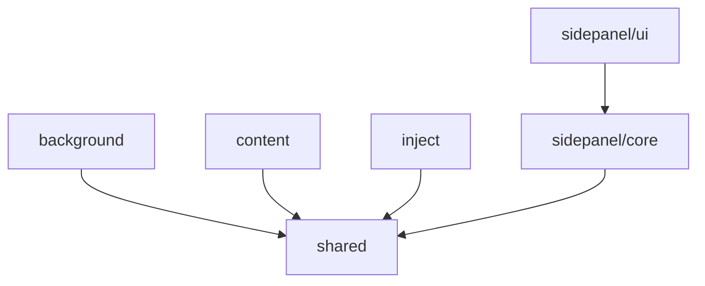
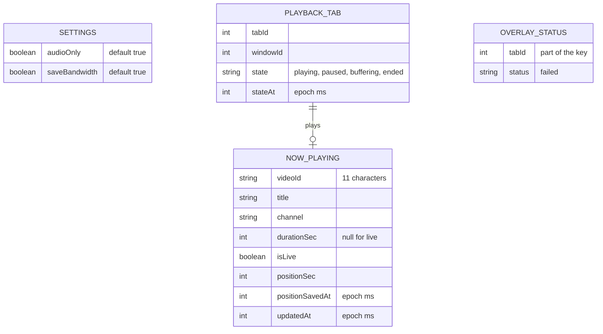
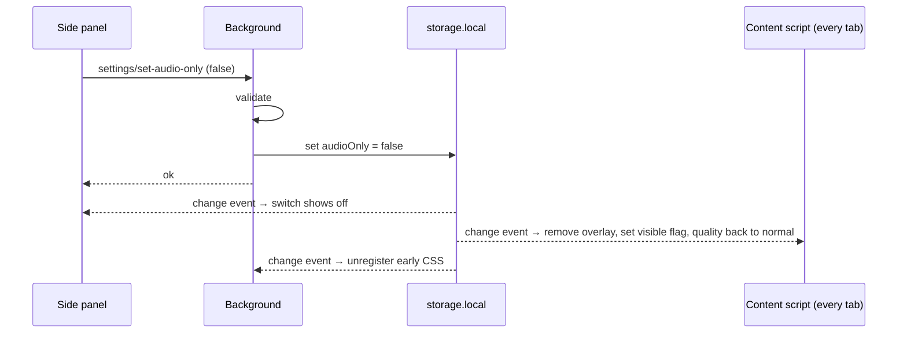
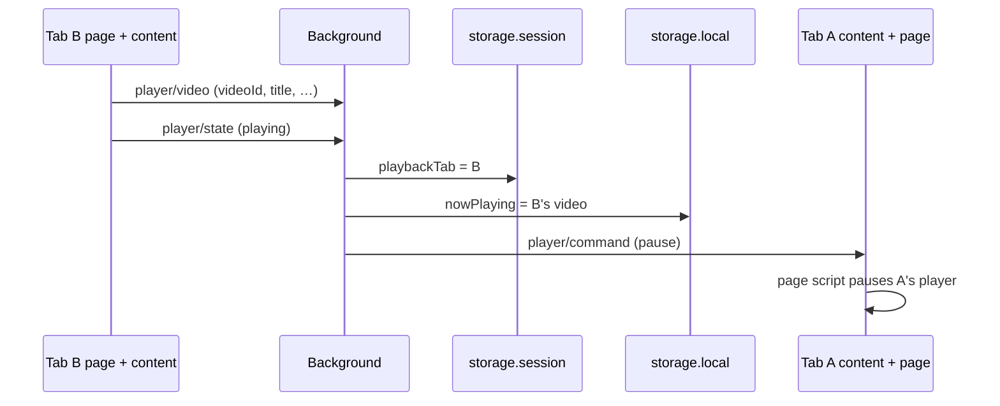
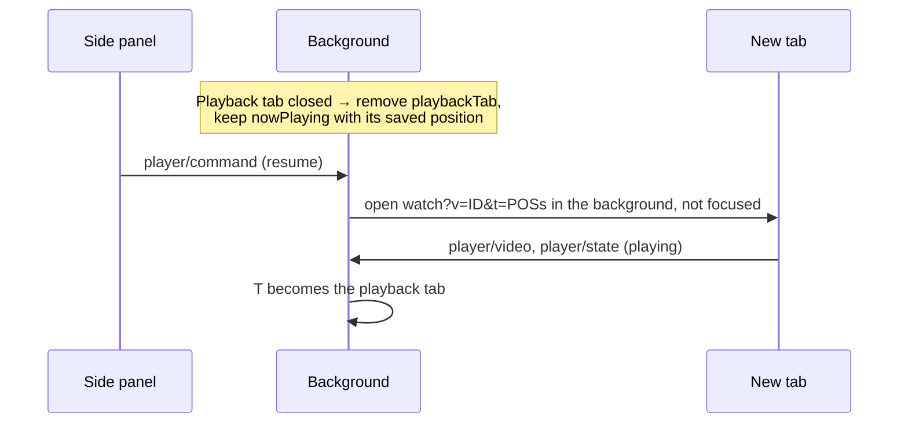

# AudioTube — System Design

| | |
|---|---|
| **Status** | Draft |
| **Last updated** | 2026-10-10 |
| **Owner** | SiriLabs |
| **Covers** | What is built (phases 1 and 2) and what phase 3 adds (marked **Phase 3**) |

## How to Read the Rules

| Keyword | Meaning |
|---|---|
| **MUST** / **MUST NOT** | A hard rule. Breaking it is a defect. |
| **SHOULD** | The default. Deviating needs a stated reason. |
| **MAY** | An allowed choice. |

## Overview

AudioTube is a Chrome extension that lets people listen to YouTube as audio only. It covers YouTube's player with an overlay, asks YouTube for the lowest video quality to save bandwidth, and gives the user a side panel to control playback while they work in other tabs. Audio always comes from YouTube's own player; the extension never plays audio itself (`GLB-003`).

There is no server. Everything the extension keeps stays in the browser on the user's device (`GLB-011`).

The functional requirements are in [`audiotube_requirements.md`](audiotube_requirements.md). This document describes how the extension is built to meet them. Where this document and the build plans disagree on scope, the current build plan wins for that phase; the requirements stay the target for v1.

## Constraints

| Item | Value |
|---|---|
| Users | Public users of Chrome on desktop |
| Built by | Solo, with AI coding agents |
| Browser | Chrome 116 or later (Manifest V3, side panel API) |
| Sites | `www.youtube.com` only |
| Tech stack | TypeScript; Svelte 5 and Tailwind 4 in the side panel; no framework elsewhere; Vite with `@crxjs/vite-plugin` — see [`tech-stack.md`](tech-stack.md) |
| Storage | `chrome.storage.local` (10 MB) and `chrome.storage.session`; no unlimited-storage permission (`PLS-024`) |
| Network | None of our own. The extension talks only to YouTube pages it runs in, and loads thumbnails from YouTube's image server (Phase 3) |
| Permissions | `storage`, `sidePanel`, `scripting`; host access to `https://www.youtube.com/*`. Phase 3 needs no new ones |
| Deadline | None |

## Out of Scope (for now)

The requirements' Non-Goals (section 9) and Future Scope (section 10) are out of scope. In addition, until their phase starts: the Queue, Previous record and Playlists (sections 5 and 6), Settings (section 7), the Playback options panel, ads, failures and system media controls (sections 4.6 to 4.10).

## Prototype

`extension/_prototype/` is the reference for the side panel's look, layout, states and wording. It shows more than is being built, and is never shipped. Where it disagrees with the requirements on a rule, the requirements win.

## System Context

## Runtime Contexts

A Chrome extension runs as several separate programs that can't share memory. They talk only through messages and storage.

| Context | Code folder | What it does | Why it's separate |
|---|---|---|---|
| Background | `src/background/` | Validates and saves every change; keeps the early CSS registered while audio-only is on; adds scripts to tabs open at install; records each tab's overlay status. **Phase 3:** chooses the playback tab, keeps Now Playing, pauses the old tab, opens Resume tabs | The one place every other context can reach; Chrome may stop and restart it at any time |
| Side panel | `src/sidepanel/` | Shows state and sends requests. `core/` holds the logic, `ui/` the Svelte components | Chrome's side panel is its own page |
| Content script | `src/content/` | Runs in every `www.youtube.com` tab: overlay, control-bar button, picture-in-picture, cover status, relays to the page script | Only a content script can change YouTube's page and still talk to the extension |
| Page script | `src/inject/` | Runs in the page's own world: calls YouTube's player (quality, play, pause). **Phase 3:** reports the player's video and state | Only code in the page's own world can reach YouTube's player object |
| Early CSS | `public/early.css` | Registered by the background while audio-only is on; hides the picture and ambient glow before the page is drawn | Has to be in place before any script can run |
| Shared | `src/shared/` | Message types, the storage read helpers, the settings schema, YouTube selectors | Used by every context; holds no business logic beyond the settings schema |

## Modules

Each code folder above is a module: `background`, `content`, `inject`, `shared`, `sidepanel/core`, `sidepanel/ui`. Arrows mean "imports". There must be no loops.

| Rule | Level | Checked by |
|---|---|---|
| A module's public API is exactly what its `index.ts` exports; other code imports it only through that file | MUST | Lint |
| No import loops | MUST | Lint |
| `sidepanel/core` never imports `sidepanel/ui` or a `.svelte` file | MUST | Lint |
| UI libraries, icon sets and CSS frameworks are imported only in `sidepanel/ui` | MUST | Lint |
| `background`, `content` and `inject` never import each other: they run in different contexts and talk only through messages and storage | MUST | Lint (Phase 3 adds the rule) |

## State Ownership

The background is the only writer of stored state ([ADR 0001](architecture/decisions/0001-background-is-the-only-writer.md)). Nothing that must survive lives only in the service worker's memory ([ADR 0003](architecture/decisions/0003-state-lives-in-storage.md)).

| State | Stored in | Key | Written by | Read by | Lives until |
|---|---|---|---|---|---|
| Audio-only mode | local | `audioOnly` | background | side panel, content | Changed by the user |
| Save bandwidth | local | `saveBandwidth` | background | content | Changed by the user (no switch yet) |
| Overlay status per tab | session | `overlayStatus:<tabId>` | background | side panel | Tab closes or loads a new page; browser restart |
| Quality the user had before | YouTube's page storage | `audiotube.previousQuality` | page script | page script | Audio-only off |
| Early CSS registration | Chrome's registered scripts | `audiotube-early-css` | background | Chrome | Audio-only off |
| Now Playing | local | `nowPlaying` | background | side panel | Replaced by another video; the user stops (later phase) |
| Playback tab | session | `playbackTab` | background | side panel | Tab lost; browser restart |
| Pending Resume | session | `resume` | background | side panel | The resumed tab plays, or is lost; browser restart |
| Last video seen in a tab | session | `tabVideo:<tabId>` | background | background | Tab closes or is replaced; browser restart |

The quality the user had before is the one value kept outside `chrome.storage`. The page script owns it because only the page can read YouTube's own preference, and it must survive a page reload ([spike](spikes/save-bandwidth.md)).

Content scripts cannot read `chrome.storage.session` (Chrome's default access level). This is intended: anything a content script needs from session state, the background sends it as a command.

### Why the playback tab is in session storage

Tab IDs are only valid until the browser closes. Keeping the playback tab in session storage means a browser restart clears it by itself, which is exactly what `PLY-054` asks for: after a restart there is no playback tab, and Now Playing (kept in local storage) comes back paused with Resume.

## Data Model

Source of truth: [`architecture/storage.dbml`](architecture/storage.dbml). `chrome.storage` is a key–value store, so each "table" there is one key, or one key per tab.

| Rule | Level | Checked by |
|---|---|---|
| Every stored value is checked when it is read; a missing or invalid value reads as its default (or as absent), never as an error | MUST | Test |
| Each independent value has its own key, so a write never rewrites another value (`GLB-013`) | MUST | Review |
| The background validates a value with the same schema readers use before writing it | MUST | Test |
| Timestamps are stored as epoch milliseconds | SHOULD | — |
| Text read from YouTube is stored as plain text, capped (title 300, channel 100 characters) and always shown as text, never as markup | MUST | Test |
| No images are stored; thumbnails are derived from the video ID (`PLS-077`) | MUST | Review |

The shared video record of `PLS-073` to `PLS-081` is not built in phase 3: Now Playing carries its own copy of the video's details. The Queue phase decides how video records are stored, with an ADR.

## Messages

### Conventions

| Topic | Rule | Level | Checked by |
|---|---|---|---|
| Types | Every message between contexts is a member of a discriminated union in `shared/`, keyed by `type` | MUST | Type check |
| Naming | `type` is `area/verb-or-noun`, e.g. `settings/set-audio-only`, `player/state` | SHOULD | — |
| Receiving | The receiver checks the message's shape before acting, and the background accepts runtime messages only from this extension | MUST | Test |
| Tab reports | A report about a tab takes the tab ID from the sender, never from the message body | MUST | Review |
| Replies | A request that changes something replies `{ ok: true, … }` or `{ ok: false, error }` with a typed error code | MUST | Type check |
| Unreachable background | Senders treat a failed send as `background-unavailable`; a content script that finds the extension gone shuts itself down | MUST | Test |
| Page messages | Content ↔ page script messages use `window.postMessage` inside an envelope with `source: 'audiotube'`, and the listener ignores messages from other windows | MUST | Test |
| Page trust | The page can read and forge window messages. The content script never forwards a page message to the background without checking it, and never acts on one that would change saved state | MUST | Review |

### Catalogue

| Message | From → to | Purpose | Status |
|---|---|---|---|
| `settings/set-audio-only` | side panel, content → background | Turn audio-only on or off | Built |
| `overlay/status` | content → background | The overlay could or could not be applied in this tab | Built |
| `quality/set` | content → page | Request the lowest quality, or put the user's back | Built |
| `quality/ready` | page → content | The page script has started; resend the mode | Built |
| `player/toggle-playback` | content → page | Click on the overlay | Built |
| `player/video` | page → content → background | The main player has a new video: ID, title, channel, duration, live | Built (phase 3) |
| `player/state` | page → content → background | Playing, paused, buffering or ended, with the position | Built (phase 3) |
| `player/position` | page → content → background | Position every 5 seconds while playing (`PLY-130`) | Built (phase 3) |
| `player/gone` | page → content → background | The main player has been missing for a moment (left the watch page, no mini-player), with the last position | Built (phase 3) |
| `player/command` | side panel → background | Play, pause, go to video, resume, check (look at the playback tab). Accepted only from an extension page | Built (phase 3) |
| `player/command` | background → content → page | Play or pause this tab's player | Built (phase 3) |

### Turning audio-only off (built)

### Another tab starts playing (Phase 3, `PLY-040`)

### Resume after the tab is lost (Phase 3, `PLY-052`, `PLY-053`)

How a tab opened in the background starts playing is not yet proven; Chrome may hold back media in a tab that has never been shown. Phase 3 starts with a spike on it.

## Key Behaviours

| Behaviour | How |
|---|---|
| Overlay on every YouTube tab | The content script in each tab follows the saved audio-only value ([ADR 0006](architecture/decisions/0006-overlay-on-every-youtube-tab.md)) |
| No flash on load | The background registers `early.css` at `document_start` while audio-only is on; the content script's `data-audiotube-visible` flag on `<html>` lifts it |
| Only the main player counts | The player is `#movie_player` on a watch page or inside `ytd-miniplayer`. Hover previews, Shorts and embeds are never covered or tracked |
| Extension updated or reloaded | The background adds the scripts to open YouTube tabs; a new copy removes what an older copy left; an older copy cut off from the extension shuts itself down |
| Service worker restarts | Listeners are registered synchronously at start; state is read back from storage; no timer the user depends on lives only in the worker |
| YouTube changes its page | Selectors live in `shared/youtube.ts`; every feature that depends on YouTube's markup fails quietly and leaves the rest working |

## Cross-Cutting Concerns

| Concern | Rule | Level | Checked by |
|---|---|---|---|
| Local-only data | All user data stays on the device; nothing about what the user listens to is sent anywhere. The only network requests the extension itself makes are YouTube thumbnails | MUST | Review |
| No telemetry | No analytics, telemetry or crash reporting | MUST | Review |
| Storage writes | Only `background/` writes to `chrome.storage` | MUST | Lint |
| Storage reads | Only the read helpers in `shared/` read `chrome.storage` | MUST | Lint |
| Replaceable design | Side panel look lives only in `sidepanel/ui/` and `theme.css`; see [ADR 0002](architecture/decisions/0002-keep-the-side-panel-design-replaceable.md) | MUST | Lint, review |
| Content on YouTube's pages | Everything the extension adds to YouTube's page lives in a shadow root or is scoped to the extension's own elements and attributes, so YouTube's styles can't reach it and it can't break YouTube's | MUST | Review |
| YouTube's player | Only the page script calls YouTube's player object ([ADR 0004](architecture/decisions/0004-reach-youtube-player-through-the-page-script.md)) | MUST | Lint |
| Ads | The extension never skips, mutes, speeds up or blocks an ad (`GLB-005`) | MUST | Review |
| Errors | Domain errors use typed error codes; the side panel turns them into readable messages | SHOULD | — |
| Text from YouTube | Shown with `textContent` or Svelte's default escaping, never as HTML | MUST | Review |
| No AI attribution | Nowhere in the repository | MUST | Git hook, review |

## Testing

| Kind | Tool | What it covers |
|---|---|---|
| Logic tests | Vitest, next to the code as `*.test.ts` | Every module's public functions and every message handler, with Chrome APIs faked |
| Browser tests | Playwright with the built extension loaded, `tests/e2e/` | Whole flows against a local copy of YouTube's page structure (`tests/fixtures/youtube.html`), served at a `www.youtube.com` address |
| Manual checks | By hand on real YouTube | What the test page can't show: real ads, live streams, signed-in accounts, YouTube's own changes |

Tests never depend on the real YouTube site, which changes without notice. When YouTube's markup changes, the test page is updated to match, then the code.

## Deployment and Operations

| Topic | Approach |
|---|---|
| Repository layout | The git repository is `devspace`; this project is `audiotube-project/`, the npm project is `audiotube-project/extension/`. CI is `devspace/.github/workflows/audiotube-project.yml`; git hooks are `devspace/.githooks/` |
| Automated checks | CI runs `npm run verify` on every push that touches `audiotube-project/` |
| Release | Not decided: Chrome Web Store listing, privacy policy, permission justifications (see Open Questions) |
| Updates | Chrome updates the extension; the background re-adds scripts to open tabs; stored values are read with defaults, so a new version can read an old one's data |

## Architecture Checks

Every MUST in this document and the ADRs, with what catches a violation. "Lint", "Type check" and "Test" run with `npm run verify`, locally and in CI.

| Rule | Checked by |
|---|---|
| Modules are imported only through their `index.ts` | Lint |
| No import loops | Lint |
| `sidepanel/core` never imports `sidepanel/ui` or `.svelte` files | Lint |
| UI libraries only in `sidepanel/ui` | Lint |
| Logic tests don't import `.svelte` files or `sidepanel/ui` | Lint |
| `background`, `content` and `inject` don't import each other | Lint (Phase 3) |
| Only `background/` writes to `chrome.storage` | Lint |
| Only the read helpers in `shared/` read `chrome.storage` | Lint |
| No hard-coded colours, fonts or sizes in the side panel outside `theme.css` | Lint |
| Every cross-context message is a typed union member | Type check |
| Receivers check message shape; the background accepts only this extension's messages | Test |
| Tab reports take the tab ID from the sender | Review |
| Changing requests reply with ok or a typed error | Type check |
| A content script cut off from the extension shuts down | Test |
| Page messages use the envelope and ignore other windows | Test |
| Page messages are never forwarded unchecked, and never change saved state | Review |
| Stored values are checked on read and fall back to defaults | Test |
| Independent values have their own keys | Review |
| The background validates before writing | Test |
| Text from YouTube is capped, stored and shown as plain text | Test, review |
| No images stored | Review |
| Nothing about listening leaves the device; no telemetry | Review |
| Additions to YouTube's page are isolated in a shadow root or scoped | Review |
| Only the page script calls YouTube's player | Lint (Phase 3 adds a rule for `movie_player` method calls outside `inject/`) |
| The extension never touches ads | Review |
| No AI attribution | Git hook, review |

## Key Decisions

See the [decision log](architecture/decisions/README.md).

## If Storage Grows

Phase 3 stores a few hundred bytes. When the Queue and Playlists arrive, the full collection (25 playlists of 1,000 videos) could approach the 10 MB limit of `chrome.storage.local` in the worst case. The Queue phase's ADR on video records must show the worst-case size, and choose between a compact format, lower stored text caps, or IndexedDB for video records.

## Open Questions

- [x] Overlay on every YouTube tab, or only the playback tab? Decided: every tab ([ADR 0006](architecture/decisions/0006-overlay-on-every-youtube-tab.md), accepted in phase 3, task 18).
- [ ] Can a tab opened in the background start playing without being shown? Answered by phase 3's spike; decides how Resume works.
- [ ] How video records are stored once the Queue and Playlists exist (`PLS-073` to `PLS-081`), and the worst-case storage size.
- [ ] YouTube saves the quality request as the user's own setting. If the extension is removed while audio-only is on, the user's YouTube stays at the lowest quality. Accept, or warn somewhere (Settings, About)?
- [ ] Chrome Web Store release: listing, privacy policy (`OQ-006`), permission justifications.

## Glossary

| Term | Meaning |
|---|---|
| Background, service worker | The extension's central program. Chrome starts it when needed and stops it when idle |
| Content script | Extension code Chrome adds to a web page; it can change the page and talk to the extension, but can't reach the page's own scripts |
| Page script | Extension code running inside the page's own world, so it can call YouTube's player; it can't talk to the extension directly |
| Isolated world / main world | The two separate script environments in a page: the content script's and the page's own |
| Side panel | Chrome's panel beside the page, where the extension's UI lives |
| Playback tab | The one YouTube tab whose video is Now Playing (`GLB-001`) |
| Now Playing | The one video that is playing or paused as the current item, or none |
| Early CSS | A stylesheet Chrome adds before the page is drawn, to hide the picture before any script runs |
| Orphaned copy | A content script left running in a tab after the extension was updated or reloaded, cut off from it |
| `chrome.storage.local` / `.session` | The extension's own storage: local survives restarts, session is cleared when the browser closes |
| ADR | Architecture Decision Record: a short note on what was decided and why |
| Spike | A short, throwaway experiment to answer a technical question before building |
