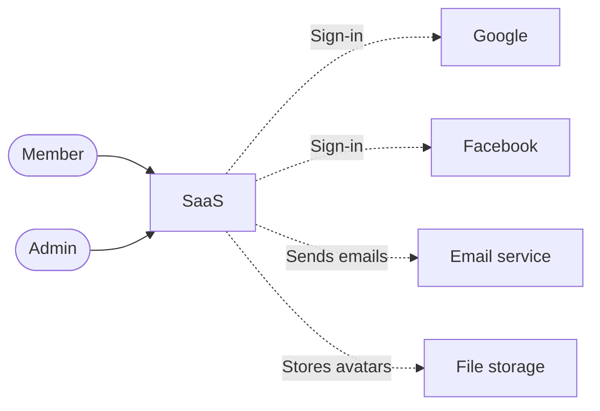
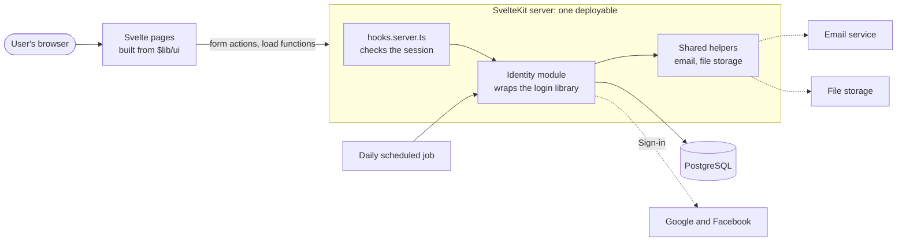
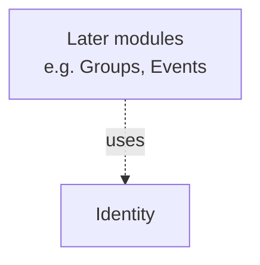

# SaaS — System Design

| | |
|---|---|
| **Status** | Approved |
| **Last updated** | 2026-10-09 |
| **Owner** | SiriLabs |

"SaaS" is a placeholder name until the real one is chosen.

## How to Read the Rules

| Keyword | Meaning |
|---|---|
| **MUST** / **MUST NOT** | A hard rule. Breaking it is a defect. |
| **SHOULD** | The default. Deviating needs a stated reason. |
| **MAY** | An allowed choice. |

## Overview

SaaS is a Meetup-style community web app where individuals find and join local groups and events. It launches in Sweden and then expands to the other Nordic countries. This document covers the system as a whole; the first module, Identity, handles accounts, login and profiles.

## Requirements

### What users can do

Identity is built in three phases. Details are in the [Identity module doc](modules/identity/README.md).

**Phase 1: accounts, login, profile**

- A person registers with their full name, email and password, and optionally a username; accepts the terms and privacy policy and confirms they are 18 or older with one checkbox; and verifies their email
- A person signs in by entering their email first and then their password, or with Google or Facebook, and can stay signed in with "remember me"
- A person who forgot their password resets it by email; a signed-in person changes it
- A person signs out of this session or of all devices
- A person manages their profile: name, username, avatar, language, time zone
- A person changes their email, links and unlinks Google and Facebook, and sets notification preferences
- A person sees their own security activity and can delete their account, with a 30-day grace period

**Phase 2: stronger sign-in**

- A person signs in with a passkey instead of a password
- A person adds an optional second step after password login: an authenticator app or a code by email, with backup codes
- A person trusts a device for 30 days
- A person sees their active sessions, revokes one, and is alerted to a login from a new device

**Phase 3: admin and compliance**

- An admin finds, suspends and reinstates users, and can sign in as a user (impersonation)
- An admin views and exports the audit log
- A person downloads their own data

### Constraints

| Item | Value |
|---|---|
| Expected customers / users | Unknown; individuals, not companies |
| Built by | Solo, with AI coding agents; a team may join after launch |
| Tech stack | SvelteKit 2 (latest), Svelte 5, TypeScript, PostgreSQL, Drizzle, Better Auth |
| Hosting budget | Not set; current estimate is about €15 to €40 per month |
| Deadline | None |
| Sensitive data | Email addresses, password hashes, IP addresses, sign-in secrets |
| Legal | GDPR; all data hosted in the EU; users must be 18 or older |
| Languages | English at launch; Swedish later |

### Out of scope

- Organizations, and per-organization rules such as enforced second step or IP allowlisting
- Separating data between customer companies — see [ADR 0003](decisions/0003-private-data-belongs-to-users.md)
- Session limits per plan
- SMS codes and phone numbers
- Signing in with a username; the username is a public handle only
- GitHub, Microsoft and Apple login
- Payments
- Live updates
- Location shown on logins and sessions
- The moderator role (planned for later)
- The organizer role, groups and events (later modules)
- Mobile app

## UX Prototype

The interactive prototype in [`../design/event-platform-prototype_v05.html`](../design/event-platform-prototype_v05.html) is the source for the look, layout, screen states and wording. It covers more than is being built: this document and the module docs decide what is in scope and what the rules are. Where the prototype and these docs disagree on a rule, these docs win.

In the prototype but not being built: organizations, members and invitations, enterprise SSO, SCIM, API credentials, the account recovery hub, step-up authentication, bot challenges, the suspicious sign-in check and the breached-password warning. Event discovery, organizer tools and participant management belong to later modules.

## Assumptions

| Assumption | Status |
|---|---|
| Private data belongs directly to a user; there are no companies or workspaces | Confirmed |
| Consent records, the security activity log and basic account deletion are part of Phase 1 | Confirmed |
| The active-sessions page and new-device alerts are part of Phase 2 | Confirmed |
| Being 18 or older is a self-declaration at sign-up, with no ID check. It shares one checkbox with the terms and privacy policy, and is still stored as its own consent record | Confirmed |
| The account deletion grace period is 30 days | Confirmed |
| Avatars are uploaded images kept in EU-hosted file storage | Confirmed |
| An EU-hosted email service sends verification, reset and alert emails | Confirmed |
| Identity only stores notification preferences; later modules send the notifications | Confirmed |
| The language preference is stored from day one, although only English exists | Confirmed |
| The admin area is minimal: find a user, suspend or reinstate, impersonate, view the audit log | Confirmed |
| Audit log entries are kept for 12 months | Confirmed |
| A username is optional. It is 3 to 30 characters (letters, numbers, dots, hyphens, underscores), starting and ending with a letter or number; upper and lower case count as the same name | Confirmed |
| Passwords are at least 8 characters, with upper and lower case letters, a number and a special character | Confirmed |
| The verification email can be resent at most 3 times per hour | Confirmed |
| A reserved list blocks usernames such as `admin`, `support` and `help` | Confirmed |
| A username can be changed once every 30 days; the old name is held for 30 days | Confirmed |
| A deleted account's username is never released for reuse | Confirmed |
| Sessions last 1 day without "remember me" and 30 days with it | Open |
| After an email change, the old address can undo it for 7 days | Open |
| A successful password reset also clears a login lockout | Open |

## System Context

## Architecture Overview

Solid arrows are parts we build and run. Dotted arrows are third-party services.

| Component | Technology | What it does | Why it's needed |
|---|---|---|---|
| Frontend | Svelte 5 pages and `$lib/ui` components | Shows pages, handles user input | The web interface |
| Backend app | SvelteKit 2 server: load functions, form actions, a few API routes | Runs all modules and serves the pages | Keeps rules and data access off the browser |
| Login library | Better Auth, running inside the app | Sign-up, login, sessions, social login, passkeys, second step | Far less security code to write and maintain — see [ADR 0005](decisions/0005-use-better-auth-for-login.md) |
| Database | PostgreSQL, accessed with Drizzle | Stores all app data; Drizzle generates migration files | Data must persist |
| Email service (third-party) | EU-hosted provider, TBD, reached over SMTP. Locally a Mailpit inbox in Docker catches every email and nothing is really sent | Sends verification, reset and alert emails | Email verification and password reset |
| File storage (third-party) | EU-hosted object storage, TBD | Stores avatar images | Avatar uploads |
| Daily job | The host's scheduler calling one protected endpoint | Permanent deletion after the grace period, releasing held usernames, clearing expired links, audit log retention | Time-based clean-up |
| Google and Facebook (third-party) | OAuth sign-in | Confirm who a person is | Social login |

There is no separate backend, queue or cache. Emails are sent during the request and rate-limit counters live in PostgreSQL.

## Modules

Arrows mean "uses". There must be no loops.

| Module | Responsible for | Owns tables | Code folder | Design doc |
|---|---|---|---|---|
| Identity | Sign-up, login, sessions, passwords, social login, passkeys, second step, profile, username, preferences, roles, consent, audit log, suspension, impersonation, deletion, data export | users, accounts, sessions, verifications, passkeys, two_factors, rate_limits, notification_preferences, consents, audit_events, username_holds | `src/lib/server/modules/identity` | [modules/identity](modules/identity/README.md) |

The email and file storage helpers are shared server code, not modules: they wrap an outside service and hold no business logic.

## How Modules Work Together

These rules apply to every module.

| Topic | Rule | Level | Checked by |
|---|---|---|---|
| Public API | A module's public API is exactly what its `index.ts` exports. Other code imports a module only through its `index.ts`. | MUST | Lint |
| Import loops | Modules do not import each other in a loop. | MUST | Lint |
| Using another module's data | A module never reads or writes another module's tables; it calls that module's public API. Storing its IDs (e.g. a user ID) is fine. | MUST | Review |
| Changes spanning two modules | The calling module starts one database transaction and passes it to the other module's public function. | SHOULD | — |
| Foreign keys between modules | Allowed. Later modules may link their tables to `users`. | MAY | — |
| Events | In-process notices for "something happened". The only one so far is "user deleted", so each module can clean up its own data without Identity calling it. | MAY | — |
| Shared code | Shared helpers wrap outside services or hold small utilities. They contain no business logic. | MUST | Review |
| Internal structure | Each module organises its internal files however it likes. | MAY | — |

## Cross-Cutting Concerns

| Concern | Rule | Level | Checked by |
|---|---|---|---|
| Private data separation | Every server function that reads or writes a user's private data takes the acting `UserId` and limits its queries to that user. | MUST | Type check |
| Proving the separation | Every feature that stores private data has a test showing one user can't read or change another user's private data. | MUST | Test |
| Passing the current user | The acting user is set once in `hooks.server.ts` into `event.locals`, then passed explicitly as a parameter. It never comes from global state or straight from request input. | MUST | Review |
| Checking logins | Every page outside the public list requires a login, checked in `hooks.server.ts` before any module code runs. | MUST | Test |
| Checking permissions | Every admin page and admin function checks the admin role, using `requireRole` from Identity. | MUST | Test |
| Input validation | All input to form actions and API routes is validated on the server with a schema. | MUST | Review |
| Replaceable design: logic | Business rules, validation, permissions and database access live only in `src/lib/server/`, never in `.svelte` files. | MUST | Review |
| Replaceable design: data only | Load functions and form actions return plain data, never styling. | MUST | Review |
| Replaceable design: tokens | Colours, fonts, spacing, corner radii and shadows come from design tokens in `src/lib/ui/theme.css`. | MUST | Lint |
| Replaceable design: libraries | A component library, icon set or CSS framework is imported only inside `src/lib/ui/`. | MUST | Lint |
| Replaceable design: tests | Logic tests do not import `.svelte` files or `$lib/ui`. | MUST | Lint |
| No AI attribution | No attribution to any AI agent appears in commit messages, PR descriptions, code comments, docs or any other file. | MUST | Git hook, review |
| Errors | Domain errors use typed error codes, turned into readable messages at the page. | SHOULD | — |
| Logging | Logs include the user ID and a request ID, and never personal details beyond that. | SHOULD | — |
| Dates and times | Stored in UTC, shown in the user's time zone. | SHOULD | — |

The public list is: `/`, `/signup`, `/verify-email`, `/login`, `/login/two-step`, `/forgot-password`, `/reset-password`, `/api/auth/*`, `/api/username-available` and `/api/jobs/daily` (which requires its own secret).

The replaceable design rules are explained in [ADR 0002](decisions/0002-keep-the-design-replaceable.md).

## Data Model

Full schema: [`database/schema.dbml`](database/schema.dbml) — the source of truth. Tables are grouped by owning module.

There is one module so far, so there are no relationships between different modules' tables yet. Identity's tables are shown in the [Identity module doc](modules/identity/README.md#data).

## Database Migrations

| Rule | Level | Checked by |
|---|---|---|
| The database changes only through migration files generated by Drizzle | MUST | Review |
| A migration that has been applied is never edited; write a new one | MUST | Review |
| `schema.dbml` is updated in the same commit as the migration | MUST | Review |
| Changes that delete or rename existing data need the owner's approval first | MUST | Review |
| Migrations run automatically on deploy | SHOULD | — |
| At most one migration per build task | SHOULD | — |

## API

Endpoints are listed in each module doc. Only the shared conventions are here.

### Conventions

| Topic | Approach |
|---|---|
| Pages | Pages read data with load functions and change it with form actions. There is no hand-written JSON API for our own pages. |
| Base path for API routes | `/api`, used only where plain HTTP is required |
| How requests prove who the user is | Session cookie, sent automatically by the browser |
| Request and response format | Form data for form actions; JSON for `/api` routes |
| Error format | Form actions return an error code and a readable message per field. `/api` routes return JSON with an error code and message, plus a matching HTTP status. |
| Lists and paging | TBD; first needed by the admin user list in Phase 3 |
| Versioning | None; frontend and backend are deployed together |

## Security and Access

### Login

Users sign in with email and password, Google, Facebook or (Phase 2) a passkey, and stay signed in through a session cookie backed by a row in the database. Details are in the [Identity module doc](modules/identity/README.md).

### Who can do what

| Role | Can do |
|---|---|
| User | Manage their own account, profile and private data |
| Admin | Everything a user can, plus find, suspend, reinstate and impersonate users, and view and export the audit log |

### Sensitive data

| Data | How it's protected |
|---|---|
| Passwords | Stored only as a one-way hash, never in plain text |
| Authenticator secrets and backup codes | Encrypted in the database |
| Session cookies | Unreadable by page scripts and sent only over HTTPS |
| Reset and verification links | Single-use and short-lived |
| Email addresses and IP addresses | Stored in the EU, removed on permanent deletion, never shown to other users |
| Google and Facebook data | Only the account link, name, email and picture are kept |

## Deployment and Operations

| Topic | Approach |
|---|---|
| Repository layout | The git repository is the parent folder, `devspace`, which holds several projects. This app lives in its `saas-project/` subfolder. CI workflow files live in `devspace/.github/workflows/` and run their steps inside `saas-project/`; git hooks live in `devspace/.githooks` and apply to every project in the repository, set with `core.hooksPath .githooks`; the hosting provider's root directory is `saas-project`. |
| Environments | Local only for now. One production environment in the EU is added once the hosting provider is chosen. |
| Automated checks | CI runs `npm run verify` on every push; nothing deploys unless it passes |
| How changes go live | TBD with the hosting provider |
| Database changes | Migration files, run automatically on deploy |
| Secrets (API keys, passwords) | The hosting platform's environment variables, never in code |
| Database backups | Daily automatic backups; retention TBD with the hosting provider |
| Errors and logs | TBD with the hosting provider |

## Hosting and Cost

The provider is not chosen yet. The preference is one EU-owned provider for the app, database, file storage and email.

| Part | Where it runs | Rough monthly cost |
|---|---|---|
| App and daily job | EU container hosting, TBD | €5 to €10 |
| Database | Managed PostgreSQL at the same provider, TBD | €10 to €20 |
| File storage | Same provider, TBD | under €1 |
| Email service | EU provider's free or starter tier, TBD | €0 to €10 |
| **Total** | | **about €15 to €40** |

Estimated on: 2026-10-09. Fits budget: no budget is set, so this needs the owner's confirmation. Fits deadline: yes, there is no deadline.

Costs are ballpark figures that have not been checked against current price lists. Check current pricing before committing.

## Architecture Checks

Every MUST in this doc, the module docs and the ADRs, with what catches a violation. "Lint", "Type check" and "Test" run automatically with `npm run verify`, locally and in CI. "Review" means a person or the review prompt checks it.

| Rule | Checked by |
|---|---|
| Modules are imported only through their `index.ts` | Lint |
| No import loops between modules | Lint |
| A module never reads or writes another module's tables | Review |
| Shared helpers contain no business logic | Review |
| Server functions touching a user's private data require the acting `UserId` | Type check |
| One user can't read or change another user's private data | Test |
| The acting user comes from `event.locals`, never global state or request input | Review |
| Pages outside the public list require a login | Test |
| Admin pages and admin functions check the admin role | Test |
| All form and API input is validated on the server with a schema | Review |
| Business logic lives only in `src/lib/server/`, never in `.svelte` files | Review |
| Load functions and form actions return no styling | Review |
| No hard-coded colours, fonts or sizes outside `theme.css` | Lint |
| Component libraries, icon sets and CSS frameworks are imported only in `src/lib/ui/` | Lint |
| Logic tests don't import `.svelte` files or `$lib/ui` | Lint |
| No AI attribution anywhere in the repository | Git hook, review |
| The database changes only through migration files | Review |
| Applied migrations are never edited | Review |
| `schema.dbml` is updated in the same commit as the migration | Review |
| Deleting or renaming existing data needs the owner's approval | Review |
| Only the Identity module imports the login library | Lint |
| Sign-up, login and reset responses don't reveal whether an email is registered | Test |
| `audit_events` rows are never edited, apart from the two allowed changes | Test |
| An impersonating admin can't change sign-in details or delete the account | Test |
| A user's last way to sign in can't be removed | Test |
| Passwords, secrets and tokens never appear in logs or audit entries | Review |

All automated checks run with `npm run verify`.

## Key Decisions

See the [decision log](decisions/README.md) for why the main choices were made.

## If Usage Grows

- Database slow under load → add indexes, then move to a larger database plan
- Sign-up emails arriving late → send them from a background queue instead of during the request
- Rate-limit counters crowding the database → move them to an in-memory store
- App memory or CPU near its limit → run a second copy; sessions live in the database, so this needs no code change
- Audit log table very large → split it by month

## Open Questions

- [ ] What is the app's real name? "SaaS" is a placeholder.
- [ ] Which hosting provider, email service and file storage? This also settles how changes go live, backup retention, and where errors and logs go.
- [ ] Is the estimated €15 to €40 per month acceptable?
- [ ] Should there be a public profile page at `/u/<username>`? It is not included.
- [ ] How long do sessions last? Suggested: 1 day without "remember me", 30 days with it.
- [ ] How long can the old address undo an email change? Suggested: 7 days.
- [ ] Does a successful password reset clear a login lockout? Suggested: yes.
- [ ] Which notification types exist? None until another module needs one.
- [ ] How are long lists paged? First needed by the admin user list.

## Glossary

| Term | Meaning |
|---|---|
| Module | A self-contained part of the app with its own folder, data and rules |
| Public API | The functions a module lets other code call, exported from its `index.ts` |
| Session | The record that keeps a person signed in between page visits |
| Session cookie | A small value the browser stores and sends with each request to identify the session |
| Form action | A SvelteKit server function that handles a submitted form |
| Load function | A SvelteKit server function that fetches the data a page shows |
| Hash | A one-way scramble of a password; it can be checked but not reversed |
| Passkey | A sign-in key kept on the person's device and unlocked by fingerprint, face or PIN, used instead of a password |
| Second step | An extra code asked for after the password, from an authenticator app or by email |
| Backup codes | Single-use codes for signing in when the second step isn't available |
| Social login | Signing in through a Google or Facebook account |
| Rate limit | A cap on how often an action can be repeated, to stop abuse |
| Lockout | A forced wait before another login attempt, after too many failures |
| Audit log | A record of who did what and when, which can't be edited |
| Impersonation | An admin signing in as a user to see what the user sees |
| Soft delete | Marking an account as deleted while keeping the data for a grace period |
| Migration | A file describing one change to the database structure |
| Design token | A named value for a colour, font or spacing, defined once in `theme.css` |
| ADR | Architecture Decision Record: a short note on what was decided and why |
| GDPR | The EU law on handling personal data |
