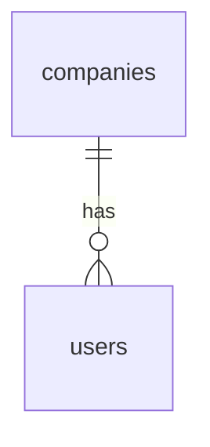
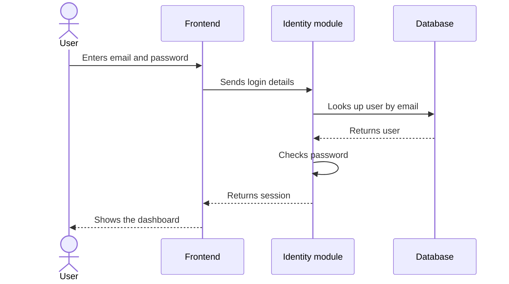

# [Module Name] Module — Design

<!--
How to use this template:
- Copy this folder to modules/<module-name>/ (lowercase, hyphens).
- Replace everything in [square brackets].
- Delete sections that don't apply.
- System-wide topics (hosting, deployment, cross-cutting rules, glossary)
  live in the system doc. Don't repeat them here; link instead.
-->

| | |
|---|---|
| **Status** | Draft / Approved / Outdated |
| **Last updated** | YYYY-MM-DD |
| **Owner** | [Name] |
| **Code folder** | [e.g. src/lib/server/modules/identity] |
| **System doc** | [System design](../../README.md) |

## Purpose

[One or two sentences: what this module is for.]

## Responsibilities

### Responsible for

- [e.g. Sign-up, login and logout]
- [e.g. Companies, users and roles]

### Not responsible for

<!-- Things people might expect here but that belong elsewhere. This prevents overlap between modules. -->

- [e.g. Subscriptions and payments — Billing module]
- [e.g. Sending emails — uses the shared email helper]

## Public Interface

<!--
The only ways other parts of the app may use this module. Anything not listed here is internal.
Other code MUST import this module only through its index.ts (see the system doc).
-->

### Functions other modules can call

<!-- Functions that read or write customer data take a CompanyId. -->

| Function | What it does | Used by |
|---|---|---|
| [e.g. getUser(companyId, userId)] | [Returns a user's name, email and role] | [Billing, Feature] |
| [e.g. requireRole(user, role)] | [Throws an error if the user lacks the role] | [All modules] |

### API endpoints

<!-- Follow the shared API conventions in the system doc. -->

| Method and path | What it does | Who can call it |
|---|---|---|
| [e.g. POST /auth/login] | [Logs a user in] | [Anyone] |
| [e.g. POST /companies/:id/invites] | [Invites a team member] | [Company admin] |

### Events

<!-- Delete if the app doesn't use events. -->

| Event | Publishes or listens | When | Data included |
|---|---|---|---|
| [e.g. company.created] | Publishes | [After a new company signs up] | [companyId] |

## Module Rules

<!--
Rules specific to this module, on top of the system-wide ones. Use MUST / SHOULD / MAY.
Add every MUST to the Architecture Checks table in the system doc. Delete if none.
-->

| Rule | Level | Checked by |
|---|---|---|
| [e.g. Passwords are only ever compared through the hashing helper] | MUST | [Review] |
| [e.g. Sessions expire after 30 days of inactivity] | SHOULD | — |

## Dependencies

| Depends on | Why |
|---|---|
| [e.g. Email service (third-party)] | [Sends invites and password resets] |
| [e.g. None — no other modules] | |

## Data

Tables owned by this module: see the `[module_name]` group in [`schema.dbml`](../../database/schema.dbml).

<!-- This module's tables only. Table names must match the DBML exactly. -->

### Data from other modules

<!-- IDs this module stores that belong to another module. Delete if none. -->

| Column | Belongs to | How this module gets the details |
|---|---|---|
| [e.g. subscriptions.company_id] | [Identity] | [Calls getCompany() — never reads the table directly] |

## Key Flows

<!-- Flows inside this module. Flows that cross modules belong in the system doc. -->

### [Flow name, e.g. Logging in]

## Security and Access

<!-- Anything specific to this module, on top of the system-wide rules. -->

- [e.g. Lock the account for 15 minutes after 5 failed login attempts]
- [e.g. Password reset links expire after 1 hour]

## Decisions

ADRs with scope "[Module Name]": see the [decision log](../../decisions/README.md).

## Open Questions

- [ ] [Question still to be answered]
