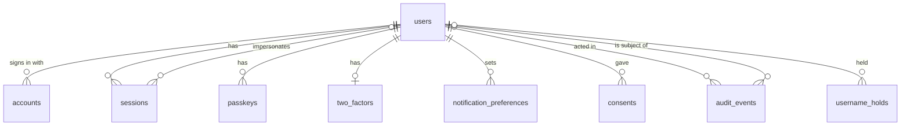
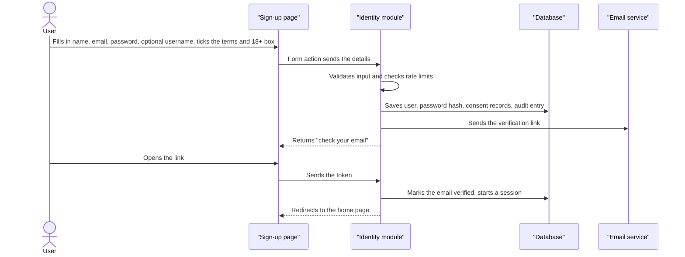
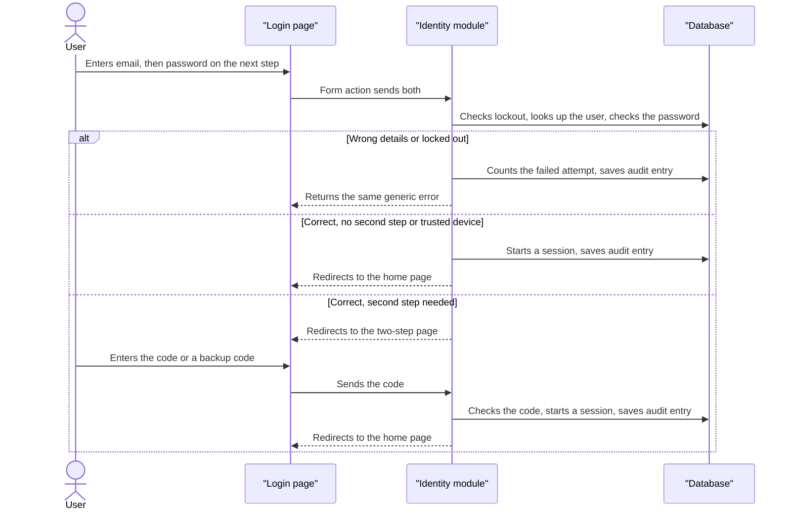
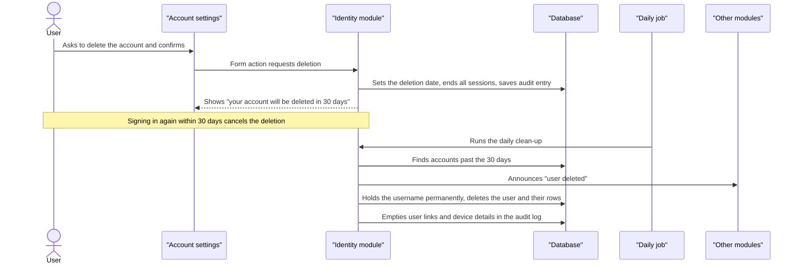

# Identity Module — Design

| | |
|---|---|
| **Status** | Draft |
| **Last updated** | 2026-10-09 |
| **Owner** | SiriLabs |
| **Code folder** | `src/lib/server/modules/identity` |
| **System doc** | [System design](../../README.md) |

## Purpose

Identity knows who each person is. It handles accounts, signing in, profiles and roles, and it keeps the records needed for security and GDPR.

## Responsibilities

### Responsible for

- Sign-up, email verification, login, logout and sessions
- Passwords: forgot, reset and change
- Google and Facebook login, and linking and unlinking them
- Passkeys, the second step (authenticator app or email code), backup codes and trusted devices
- Profile: name, username, avatar, language and time zone
- Email change
- Notification preferences (storing them only)
- Roles (user, admin) and the permission checks other modules call
- Rate limits and login lockout
- Consent records, the security activity log and the audit log
- Suspension, impersonation, account deletion and export of Identity's own data

### Not responsible for

- Groups, events, organizers and anything else community-related — later modules
- Sending notifications — later modules read the preferences and send
- Delivering email and storing files — the shared email and file storage helpers
- How the admin and settings pages look — pages built from `$lib/ui` that call Identity's functions
- Deleting or exporting other modules' data — each module does its own when Identity announces "user deleted"

## Build Phases

| Phase | Contents |
|---|---|
| 1 | Registration, email verification, login, logout, passwords, Google and Facebook, profile, username, email change, notification preferences, consent records, security activity log, account deletion |
| 2 | Passkeys, second step, backup codes, trusted devices, active-sessions page, new-device alerts |
| 3 | Admin area (find, suspend, reinstate, impersonate), audit log view and export, data export |

## Public Interface

Other code MUST import this module only through its `index.ts` (see the system doc). Everything `index.ts` exports is listed in the two function tables below.

### Functions other modules can call

| Function | What it does | Used by |
|---|---|---|
| `requireUser(locals)` | Returns the signed-in user or stops the request | All pages and modules |
| `requireRole(user, role)` | Stops the request if the user lacks the role | Admin pages, later modules |
| `getPublicProfiles(userIds)` | Returns name, username and avatar only; safe to show to anyone | Later modules |
| `getContactDetails(userId)` | Returns email, name, language and time zone, for sending notifications | Later modules |
| `getNotificationPreferences(userId)` | Returns what the user has opted into | Later modules |
| `recordAuditEvent(actor, action, target)` | Appends an entry to the audit log | Later modules |
| `onUserDeleted(handler)` | Registers a clean-up to run when a user is permanently deleted | Later modules |

### Functions the pages call

These are exported for this app's own pages and endpoints. Other modules don't call them.

| Function | What it does | Used by |
|---|---|---|
| `signUp(input, context)` | Checks the input (full name, email, password, optional username, the consent checkbox), registers the account and sends the verification email. Gives the same answer whether or not the email is already registered. | `/signup` |
| `checkUsernameAvailable(username, forUser)` | Says whether a username can be taken, and why not if it can't. Names on hold for someone else count as taken | `/api/username-available` |
| `changeUsername(userId, username)` | Sets, changes or removes the acting user's username under the 30-day rules | `/settings/profile` |
| `usernameChangeAllowedAt(userId)` | Says when the acting user may next change their username | `/settings/profile` |
| `getSessionUser(headers, cookies)` | Finds who is signed in from the session cookie; the only source of the acting user | `hooks.server.ts` |
| `limitRequests(name, subject)` | Counts one request against a named limit and says whether it is allowed | `/api/username-available` |
| `changePassword(user, headers, cookies, input, context)` | Changes the acting user's password after checking the current one; ends their other sessions | `/settings/account` |
| `signOutEverywhere(user, headers, cookies, context)` | Ends every session of the acting user | `/settings/security` |
| `getProfile(userId)` | Reads the acting user's own profile | `/settings/profile` |
| `setAvatar(userId, bytes)` / `removeAvatar(userId)` | Stores or removes the acting user's profile picture | `/settings/profile` |
| `readAvatar(fileName)` | Reads a stored profile picture for serving | `/files/avatars/[file]` |
| `updateProfile(userId, input)` | Changes the acting user's own name, language and time zone | `/settings/profile` |
| `socialProviders()` | Lists the sign-in providers that have credentials set | `/login`, `/signup` |
| `startSocialSignIn(provider, cookies)` | Starts a sign-in with Google or Facebook and returns where to send the person | `/login`, `/signup` |
| `handleAuthRequest(request)` | Handles the provider's return, and refuses every other library address | `/api/auth/*` |
| `completeWelcome(user, input, context)` | Records the consents and optional username after a first provider sign-in | `/welcome` |
| `listConnections(userId)` | Lists the acting user's ways of signing in | `/settings/connections`, `/settings/account` |
| `startLinkingProvider(user, provider, headers, cookies)` | Starts connecting Google or Facebook to the acting user's account | `/settings/connections` |
| `unlinkProvider(user, provider, headers, context)` | Disconnects a provider, unless it is the last way to sign in | `/settings/connections` |
| `setFirstPassword(user, headers, input, context)` | Gives a password to someone who has only signed in with a provider | `/settings/account` |
| `requestEmailChange(user, headers, input, context)` | Starts a change of email; nothing changes until the link sent to the new address is opened | `/settings/account` |
| `canUndoEmailChange(token)` / `undoEmailChange(token, context)` | Checks and uses the undo link sent to the old address | `/undo-email-change` |
| `requestAccountDeletion(user, headers, cookies, input, context)` | Schedules the acting user's account for deletion in 30 days and signs them out everywhere | `/settings/account` |
| `runDailyJob()` | The daily clean-up: permanent deletions, expired holds and links, old audit entries | `/api/jobs/daily` |
| `listPasskeys(userId)` / `renamePasskey(userId, id, name)` / `removePasskey(userId, id, context)` | Lists, names and removes the acting user's own passkeys. The last way to sign in can't be removed | `/settings/security` |
| `isTwoStepOn(userId)`, `startTwoStepSetup(...)`, `confirmTwoStepSetup(...)`, `regenerateBackupCodes(...)`, `turnOffTwoStep(...)` | The acting user's second step: set up with a QR code, switch on with a code, replace backup codes, switch off. Each change needs the password or a code | `/settings/security` |
| `hasTwoStepChallenge(headers)` / `sendTwoStepEmailCode(headers, context)` / `completeTwoStepLogin(method, code, headers, cookies, context, trustDevice)` | Finishes a login that is waiting for its code: from the app, by email or a backup code; optionally trusting the device | `/login/two-step` |
| `listSecurityActivity(userId)` | Lists the acting user's own recent security events, newest first | `/settings/security` |
| `logIn(input, cookies, context)` | Signs in with email and password; same answer for a wrong password and an unknown email | `/login` |
| `logOut(headers, cookies, context)` | Ends the current session | `/logout` |
| `requestPasswordReset(email, context)` | Emails a reset link if the address has an account; same answer either way | `/forgot-password` |
| `resetPasswordLinkState(token)` | Says whether a reset link is usable, expired or not valid | `/reset-password` |
| `resetPassword(input, context)` | Sets a new password from a reset link and ends every session | `/reset-password` |
| `verifyEmail(token, cookies, context)` | Confirms an email from its link and signs the person in; says if the link is expired or can't be used | `/verify-email` |
| `resendVerificationEmail(email, context)` | Sends the verification email again, at most 3 times per hour; same answer whether or not the address is registered | `/verify-email` |

### Pages and endpoints

Pages use form actions, following the shared conventions in the system doc.

| Path | What it does | Who can call it |
|---|---|---|
| `/signup` | Registers a new account | Anyone |
| `/verify-email` | Shows "check your inbox" after sign-up; confirms the email from the link; resends the link; handles expired and invalid links | Anyone |
| `/login` | Signs in: email first, then the password on a second step; or Google, Facebook or a passkey | Anyone |
| `/login/two-step` | Takes the authenticator code or a backup code. Only reachable straight after a correct password | Anyone part-way through login |
| `/logout` | Signs out of this session; a submitted form only | Signed-in users |
| `/forgot-password` | Requests a reset link | Anyone |
| `/reset-password` | Sets a new password from the link | Anyone |
| `/undo-email-change` | Reached from the notice sent to the old address: undoes a change of email within 7 days. Added in task 13; not yet confirmed by the owner | Anyone with the link |
| `/welcome` | After the first Google or Facebook sign-in: accepts the terms and confirms 18+, and optionally picks a username | Signed-in users |
| `/settings/profile` | Name, username, avatar, language, time zone | Signed-in users |
| `/settings/account` | Change email, change password, delete account | Signed-in users |
| `/settings/security` | Passkeys, second step, backup codes, active sessions, activity log, sign out everywhere | Signed-in users |
| `/settings/connections` | Link and unlink Google and Facebook | Signed-in users |
| `/settings/notifications` | Notification preferences | Signed-in users |
| `/settings/privacy` | Download my data, see accepted terms | Signed-in users |
| `/admin/users` | Finds users | Admin |
| `/admin/users/[id]` | Suspends, reinstates and impersonates a user | Admin |
| `/admin/audit` | Views and exports the audit log | Admin |
| `/api/auth/*` | Only the addresses on a short allowed list reach the login library: the Google and Facebook return addresses (`/api/auth/callback/google` and `/facebook`), and the four addresses of the passkey exchange under `/api/auth/passkey/` (start and finish adding a passkey, start and finish signing in with one). Every other address under it answers "not found" | Anyone |
| `GET /api/username-available` | Says whether a username is free; rate limited | Anyone |
| `GET /files/avatars/[file]` | Serves a profile picture. Added in task 10 for local-disk storage; not yet confirmed by the owner | Anyone |
| `POST /api/jobs/daily` | Runs the daily clean-up. Needs `Authorization: Bearer <DAILY_JOB_SECRET>`; with no secret set it can't be run at all | The scheduler, with a secret |

### Events

| Event | Publishes or listens | When | Data included |
|---|---|---|---|
| User deleted | Publishes | When an account is permanently deleted, after the grace period | userId |

## Module Rules

These apply on top of the system-wide rules.

| Rule | Level | Checked by |
|---|---|---|
| Only this module imports the login library. Everything else goes through this module's `index.ts`. | MUST | Lint |
| Sign-up, login and reset responses don't reveal whether an email is registered. | MUST | Test |
| `audit_events` rows are never edited. Only two changes are allowed: permanent account deletion empties the user links, IP address and device details; the retention job deletes rows older than 12 months. | MUST | Test |
| While impersonating, an admin can't change the password, email or sign-in methods, and can't delete the account. | MUST | Test |
| A user's last way to sign in can't be removed. | MUST | Test |
| Passwords, secrets and tokens never appear in logs or audit entries. | MUST | Review |
| Audit entry details hold no personal information beyond the user links, IP address and device details. | SHOULD | — |
| Every impersonation is recorded in the audit log and the user is told by email. | SHOULD | — |
| A password change, suspension or deletion request ends the user's other sessions. | SHOULD | — |

## Dependencies

| Depends on | Why |
|---|---|
| Better Auth (library) | Sign-up, login, sessions, social login, passkeys, second step, admin roles |
| Email helper (shared) | Sends verification, reset and alert emails |
| File storage helper (shared) | Stores avatar images |
| Google and Facebook (third-party) | Social login |
| No other modules | |

### What the library covers and what we write

| Covered by the library | Written by us |
|---|---|
| Email and password, email verification, password reset and change | Progressive login lockout |
| Google and Facebook login, account linking | Username change rules and holds |
| Sessions, "remember me", sign out everywhere | Consent records |
| Usernames (uniqueness, format) | Audit log and security activity view |
| Authenticator app, email codes, backup codes, trusted devices | Account deletion grace period and permanent deletion |
| Passkeys | Data export |
| Admin role, suspension, impersonation | Notification preferences |
| Rate limiting | The "user deleted" notice to other modules |

## Data

Tables owned by this module: see the `identity` group in [`schema.dbml`](../../database/schema.dbml).

`verifications` and `rate_limits` have no relationships to other tables.

The first seven tables (`users`, `accounts`, `sessions`, `verifications`, `passkeys`, `two_factors`, `rate_limits`) are shaped by the login library. Their exact columns are confirmed against the library's generated schema when each is first built.

On permanent deletion every row tied to the user is deleted, except rows in `audit_events` and `username_holds`, which stay with the user link emptied.

## Key Flows

### Signing up

If the email is already registered, the page shows the same "check your email" message, and the existing owner gets an email offering to sign in or reset their password.

### Logging in

### Deleting an account

## Security and Access

- Passwords are at least 8 characters and contain an upper case letter, a lower case letter, a number and a special character. The page shows each rule as it is met.
- Login asks for the email first and the password on a second step. The first step gives the same response for every email, so it never reveals whether an account exists.
- A wrong password and an unknown email get exactly the same answer. When the password is right but the email isn't verified yet, the person sees "Verify your email to continue" with a resend button; this appears only after a correct password, so it reveals nothing to someone guessing.
- Sessions: without "remember me" a session lasts 1 day and its cookie ends with the browser; with it, 30 days from the last use. No session lasts more than 90 days from when it started.
- After 5 failed logins in a row for an email, further attempts must wait: 1 minute, then 2, 4, 8 and at most 15 as failures continue. During the wait every attempt gets the usual "didn't work" answer, even with the right password, and is not counted. A successful login, or a day without failures, clears the count. This applies to every email, registered or not.
- Requests are limited per network address (IP): 10 sign-ups an hour, 30 login attempts per 15 minutes, 60 username checks a minute. Sign-up is also limited to 5 an hour per email. Forgot password is limited in its own task.
- Email verification links last 24 hours. Password reset links last 1 hour and work once.
- The verification email can be resent at most 3 times per hour.
- Forgot password always shows the same success message. It is limited to 3 requests an hour per email and 10 per network address.
- A password reset ends every session of the account, clears any login lockout and sends a confirmation email.
- Changing a password requires the current one and ends the user's other sessions.
- An email change takes effect only after the link sent to the new address is opened. Someone with a password must give it to start a change. Asking for an address another account has gets the same answer and sends nothing.
- Once a change takes effect, the old address is told and gets a link that undoes it for 7 days. Undoing restores the old address and ends every session. The link works once, and only a scrambled form of it is stored.
- Signing in with Google or Facebook using an email that already has an account does not merge them automatically. The person signs in to the existing account first and links the provider from settings.
- A provider is offered only when its credentials are set. A first provider sign-in creates the account without consents, so the person is held at `/welcome` until they accept the terms and confirm their age.
- Connecting a provider is always done on purpose by someone already signed in, so the provider account may have a different email from the app account. A provider account that is already connected to another person is refused.
- Someone who has only signed in with a provider can set a first password from account settings. That form does nothing for people who already have a password; they must give their current one to change it.
- The login library's own web addresses are closed to the outside, apart from the provider return addresses, so nobody can go around the app's rules (limits, lockout, consents, the password rule) by calling the library directly.
- A passkey signs a person in on its own, with no password and no second step. Adding one is an exchange between the browser and the login library, and is only allowed within a day of logging in.
- A passkey counts as a way to sign in, alongside a password and each connected provider. Whichever is the last one can't be removed.
- The second step applies to password logins only. With it on, a correct password does not sign anyone in: it starts a short wait for a 6-digit authenticator code or a single-use backup code. Code attempts are limited to 10 per 15 minutes per network address.
- Setting it up, replacing the backup codes and switching it off each need the password. It is only switched on once a code from the app has been entered. Backup codes are shown once.
- A code by email is another way to complete the second step, for anyone who has it on: it is sent on request to someone who has just entered the right password, works for 10 minutes, and can be asked for 5 times per 15 minutes per network address. Only a scrambled form of the code is stored.
- "Trust this device for 30 days" marks the browser with a signed cookie the page's scripts can't read. A correct password from that browser then signs in without the second step. Other browsers are still asked, and switching the second step off clears the mark.
- A username is optional. When set: 3 to 30 characters (letters, numbers, dots, hyphens, underscores), starting and ending with a letter or number, compared without regard to case, checked against a reserved list kept in code. Setting a first username is always allowed; replacing or removing one is allowed once every 30 days. The old name is held for 30 days, during which only its previous owner can take it back. Changing only the capital letters is not a change. A deleted account's name is held permanently.
- Sign-up has one checkbox covering the terms, the privacy policy and being 18 or older. Each is still saved as its own consent record.
- A suspended user can't sign in and their sessions are ended.
- Audit log entries are kept for 12 months.

## Decisions

ADRs with scope "Identity": see the [decision log](../../decisions/README.md).

## Open Questions

- [ ] How long do sessions last? Suggested: 1 day without "remember me", 30 days with it.
- [ ] How long can the old address undo an email change? Suggested: 7 days.
- [ ] Does a successful password reset clear a login lockout? Suggested: yes.
- [ ] Should there be a public profile page at `/u/<username>`? It is not included.
- [ ] Which notification types exist? None until another module needs one.
