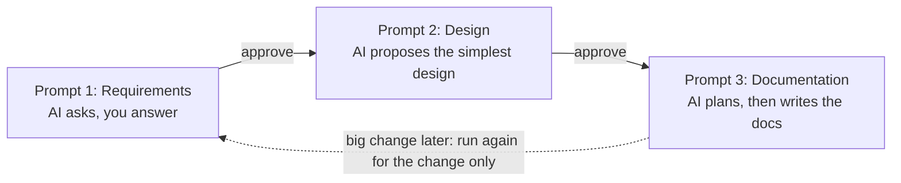
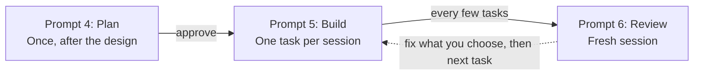

# How to Use the Design and Build Prompts

Oct 4, 2026 · @D2VK

## Overview

Three prompts take you from a rough idea to approved design docs in your repo, and the AI waits for your approval between each step.



Run them in order in one chat. Prompt 1 agrees the requirements, Prompt 2 agrees the simplest design that meets them, and Prompt 3 writes that design into your templates. Splitting the work stops the AI from designing before it understands the problem, or documenting a design you haven't settled.

## When to use them

Use all three prompts for a new app, or a big new part of an app, where you expect to live with the design for months. Skip parts of the flow when the stakes are lower.

| Situation | Use |
| --- | --- |
| New web app you'll maintain | Prompts 1, 2 and 3 |
| Quick prototype or throwaway experiment | Prompts 1 and 2 only. Docs aren't worth it yet. |
| You already know the requirements well (e.g. rebuilding an existing app) | Fill the Prompt 1 template fully. The AI will skip answered questions, so this round is short. |
| You have a design and only need it written up | Paste the design, then Prompt 3 |
| Small change to an existing app (a new field, a new page) | None. Just ask directly. |
| Big change to an existing app (new login method, new payments) | Prompts 1 and 2 for the change, then the "changes" section below |

A rule of thumb: if the decision would be costly to undo, run the prompts. If it's easy to change later, don't.

## Before you start

Five minutes of preparation saves a round or two of questions.

- [ ] Write one or two sentences on what the app does and who uses it.
- [ ] List the main things users do, even roughly.
- [ ] Note what you already know: expected users, budget, deadline, tech you're comfortable with. Leave the rest blank. Blank is fine; the AI will ask.
- [ ] Start a fresh chat. Old conversations carry assumptions you can't see.
- [ ] Start from the project templates in your repo; they include the standing rules for every project. Outside the repo, attach the project-templates zip instead.

Don't guess answers to look complete. A wrong answer is worse than a blank, because the AI will design around it.

## Prompt 1: Requirements

Prompt 1 turns a rough idea into an agreed list of requirements, without the AI deciding anything for you.

**When:** first message of a fresh chat.

**How:**

1. Fill in the template fields you know. Leave the rest blank.
2. Answer the AI's questions, 3 to 5 per round. "Not sure" is a valid answer; the AI will suggest a default and wait for you to confirm it.
3. Expect 2 to 3 rounds. The AI then gives a summary: requirements, topics marked "not needed", and assumptions.
4. Read the summary carefully, then reply with corrections or "approved".

**What to check in the summary:**

- Topics marked "not needed". This is where the AI most often guesses wrong, for example dismissing payments you plan to add later.
- Assumptions. Each one is a decision you didn't make. Confirm or change it.
- Anything you said that's missing.

**Tips:**

- If the AI starts proposing a design, reply: "Not yet. Finish the requirements first."
- If it flags a conflict or an unrealistic timeline, take it seriously. That's the cheapest moment to change course.
- Mention plans you know are coming, even if not now, e.g. "payments in 6 months". The design can leave room without building it.

## Prompt 2: Design

Prompt 2 produces the simplest design that meets the approved requirements, for you to review in the chat.

**When:** in the same chat, right after you've approved the requirements summary.

**How:**

1. Paste Prompt 2 as is. It needs no filling in. For an app with modules, the AI first proposes a module split and waits for your approval (see "Apps with modules").
2. Read the design: the Mermaid architecture diagram, components, data, a typical user flow, cost, and growth notes.
3. Push back on anything that feels heavy. Ask "why is this needed?" for any component you don't understand.
4. Iterate in the chat until you're happy. Changes are cheap here; they get expensive once docs exist.

**What to check in the design:**

- Every component has a reason tied to one of your requirements.
- The "cut or merged" list. If the AI cut nothing, ask it to try once more.
- Cost fits your budget, and the AI said so explicitly.
- Remaining assumptions. Resolve them now or accept them knowingly.
- The growth notes describe signals to watch, not things built now.

**Tips:**

- If a requirement changes mid-design, just say so. The prompt tells the AI to revise only the affected parts and tell you what changed.
- Ask for a second user flow if the first one doesn't cover the part you're worried about.

## Prompt 3: Documentation

Prompt 3 writes the approved design into your templates: the system doc, ADRs and the DBML schema.

**When:** in the same chat, once you're happy with the design.

**How:**

1. Fill in where the templates are, today's date, and what to document: the whole app or one module. AI models often don't know the current date and will guess wrong in the ADRs.
2. Attach the templates, or point to them in the repo if you're using a coding agent.
3. The AI replies with a plan: files, ADR titles, database tables with columns, and API endpoints. Anything you never discussed is marked.
4. Review the plan, especially the marked items and the ADR list, then give the go-ahead.
5. Read the finished docs and the AI's list of consistency fixes.

**What to check in the docs:**

- "TBD" entries and Open Questions. These are real gaps. Answer them in the chat and ask the AI to update the docs.
- The ER diagram matches the DBML (same tables, same relationships).
- Every relationship in the DBML says what happens on delete. Cascade on the wrong relationship can wipe out data.
- Diagrams render. Open the Markdown in GitHub or your editor's preview. Paste the DBML into dbdiagram.io.
- The main doc's status is "Draft". Change it to "Approved" yourself once you've reviewed it.

**Tips:**

- If the AI wrote an ADR for something trivial, delete it. ADRs are only for decisions that are costly to reverse.
- Commit the docs alongside the code, so changes to both show up together in history.

## Implementation phase

Once the design docs are approved, three more prompts take the app from docs to working code, run in a coding agent such as Claude Code inside your repo.



Prompt 4 runs once to fill in `CLAUDE.md` and the build plan. Prompt 5 then builds one task per fresh session, and Prompt 6 checks the work every few tasks so drift from the design is caught while it's still small. All three assume the repo layout from the project templates: `CLAUDE.md` at the root, design docs in `docs/architecture/`, and the plan in `docs/build-plan.md`.

## Prompt 4: Plan

Prompt 4 turns the approved design docs into a filled-in `CLAUDE.md` and `docs/build-plan.md`. It writes no code.

**When:** once, after the design docs are approved and committed. Set the system doc's status to "Approved" first; Prompt 4 asks before working from a draft.

**How:**

1. Start a fresh Claude Code session in the repo and paste Prompt 4 with today's date.
2. The agent reads the design docs and replies with a plan: tooling choices, folder structure, conventions, and the task list. Anything the design didn't decide is marked.
3. Review the marked items. These are typically the test runner, linter and code conventions, and each should come with a one-line reason.
4. Approve, let it write both files, then commit them.

**What to check:**

- Task 1 is project setup and a first deploy, including `npm run verify` and CI.
- Every requirement maps to at least one task. The agent lists any that don't.
- Each task is small: one goal, a few "Done when" checks. Split any task with more than one goal.
- "Done when" checks are things you could verify yourself, not "code is clean".
- Commands in `CLAUDE.md` match the tech stack, and its "Replaceable design" and "No AI attribution" sections are still there.

**Tips:**

- Keep `CLAUDE.md` short. If the agent copied design content into it, ask it to replace that with a pointer to the doc.
- After a big design change, run Prompt 4 again and add: "Update the existing files; keep tasks marked Done as they are."

## Prompt 5: Build

Prompt 5 builds exactly one task from the build plan, tests it, and stops.

**When:** once per task, in a fresh Claude Code session each time. A fresh session keeps the agent focused on one task and stops old context from leaking in.

**How:**

1. Fill in the task number, or "next" for the first task that's ready, plus your two choices: whether to check in before coding, and whether the agent should commit when done.
2. If you chose to check in, the agent restates the task: what it will build, which files it will touch, migrations, tests, and anything unclear. Approve or correct it.
3. The agent builds the task, runs `npm run verify`, and fixes what fails.
4. It ticks off the task's "Done when" checks, marks the task Done, and reports back.

**What to check in the report:**

- How to try it yourself. Do try it: a passing test suite doesn't prove the feature works the way you meant.
- Decisions it made along the way. Each one should be small; anything bigger should have been asked first.
- Any design doc or schema changes, and any SHOULD rule it deviated from, each with the reason.
- Work it noticed but left out of scope, recorded in the task's notes.

**Tips:**

- Start with check-ins on. Once you trust the plan and the agent, switch to "only if something is unclear" for routine tasks.
- If the agent stops because the design conflicts with what the task needs, that's working as intended. Decide, update the design docs if needed, then continue.
- Leave commits to yourself at first, so you review each task's changes before they pile up.

## Prompt 6: Review

Prompt 6 checks what was built against the design docs, `CLAUDE.md` and the build plan, and reports problems without changing anything.

**When:** in a fresh session, never the one that wrote the code, since an agent tends to approve its own work. Run it after any task that touched security, data or more than one module, and after every few tasks otherwise. Always run it before a release.

**How:**

1. Fill in what to review: one task, one module, the whole app, or changes since a commit or branch.
2. The agent runs `npm run verify`, reads the code and docs, and reports findings. It changes nothing yet.
3. Pick which findings to fix and say so. The agent fixes them under the same rules as Prompt 5.

**What to check in the report:**

- "Must fix" items first. These are broken behaviour, security gaps, or one customer's data reachable by another.
- Docs out of date. Decide whether the code or the docs are right.
- Anything marked "Question". The agent wasn't sure; you decide.

**Tips:**

- A short report is a good sign, not a lazy review. The prompt tells the agent to skip style issues the linter already catches.
- If the same kind of finding keeps coming back, add a rule for it to `CLAUDE.md`, so future tasks avoid it.

## Handling changes later

Once docs exist, update them with the change rather than starting the whole flow again.

**Same chat, small change:** describe the change and say "update the docs". Prompt 3 already tells the AI to touch only the affected files and update the "Last updated" date.

**New chat, bigger change:**

1. Attach or point to the existing docs.
2. Run Prompt 1, describing only the change, and add: "The current design is in the attached docs. Ask only about what this change affects."
3. Run Prompt 2 and 3 as usual.

**Changing a decision:** never edit an accepted ADR's decision. The AI should write a new ADR that supersedes the old one, following the steps in the decision log. Check that the old ADR's status and the index were both updated.

## Chat assistants vs coding agents

The prompts work in both; the difference is mostly in Prompt 3's output.

|  | Chat assistant (e.g. Claude.ai) | Coding agent (e.g. Claude Code) |
| --- | --- | --- |
| Best for | Prompts 1 and 2: back-and-forth discussion | Prompt 3: writing files into the repo |
| Templates | Attach the zip or paste the files | Point to `docs/architecture/` in the repo |
| Prompt 3 output | One code block per file, which you copy into the repo | Files created directly at the template paths |
| DBML check | Paste into dbdiagram.io yourself | The agent can run `dbml2sql` to check it parses |

A practical split: do Prompts 1 and 2 in a chat assistant, then paste the approved design into a coding agent along with Prompt 3. Prompt 3 handles this: if the design isn't in the conversation, it asks you to paste it.

## Common problems and fixes

Most problems come from the AI drifting from the prompt over a long chat. A short reminder usually fixes it.

| Problem | What to say |
| --- | --- |
| AI proposes a design during Prompt 1 | "Not yet. Finish the requirements first." |
| Asks too many questions or keeps going past 3 rounds | "Give me the summary now. List anything unresolved as an assumption." |
| Design feels heavy (queues, caches, many services) | "Which requirement needs X? If none, remove it." |
| Jargon creeps back in | "Explain \[term\] in one sentence and keep the rest plain." |
| ASCII diagrams instead of Mermaid | "Redraw that as a Mermaid diagram." |
| Prompt 3 invents details we never discussed | "Replace anything we didn't discuss with TBD and add it to Open Questions." |
| Mermaid in chat output is garbled | "Use an outer fence of four backticks for Markdown files." |
| A diagram won't render | Paste the error back to the AI. Usually a label needs double quotes. |
| Chat got very long and the AI forgets earlier decisions | Start a new chat, paste the approved summary or design, and continue from the next prompt. |

## Apps with modules

The prompts handle both small apps and apps split into modules, such as a SaaS with Identity, Billing and Projects. A module is a self-contained area with its own code folder, its own data, and a few functions other modules may call. The difference shows up at three points.

| Prompt | What changes with modules |
| --- | --- |
| Prompt 1 | Requirements are summarised by area of the app. These areas usually become the modules. |
| Prompt 2 | Starts with a module split for your approval, before any design. |
| Prompt 3 | Writes a system doc plus one doc per module, and groups tables by module in the DBML. |

**What to check in the module split:**

- Each module has a clear "not responsible for" list, so no two modules overlap.
- Each table is owned by exactly one module.
- The module diagram has no loops: if A uses B, B doesn't use A.
- There aren't too many. Two modules that always change together should be one, and a small app needs none.

**Adding a module later:** run Prompt 1 for the new area only, adding "The current design is in the attached docs. Ask only about what this new module affects." Then run Prompt 2, and Prompt 3 with "What to document" set to the new module.

## Standing rules for every project

Three rules apply to every project. They're built into the templates and prompts, so you never need to repeat them.

| Rule | What it means | How it's enforced |
| --- | --- | --- |
| Svelte stack | Svelte 5 and SvelteKit, latest stable. Prompt 2 decides whether SvelteKit's server is also the backend. | Prompts 1, 2 and 4; `.claude/rules/svelte.md` stops old Svelte 4 syntax |
| Replaceable design | The look (colours, components, layout) can be swapped without touching business logic, data or screen behaviour. | `CLAUDE.md` rules, an ADR in the design docs, and the Prompt 6 review |
| No AI attribution | No AI mention anywhere in the repo: commits, PRs, code comments, docs. | Claude Code setting in `.claude/settings.json`, a `CLAUDE.md` rule, and a commit-msg hook that rejects offending commits |

**The test for replaceable design:** replacing `src/lib/ui/`, the theme file and the app shell must not require changing any server code, load function, form action or non-UI test.

**Why three layers for attribution:** `CLAUDE.md` guides the agent but doesn't enforce anything, and the Claude Code setting has had reported gaps. The git hook is what actually blocks a commit. It can't see PR descriptions or code comments, which is why Prompt 6 checks those too.

## MUST, SHOULD and MAY

Every rule in the design docs, `CLAUDE.md` and the prompts uses one of three keywords, so the agent knows which rules it may bend.

| Keyword | Meaning | What the agent does |
| --- | --- | --- |
| MUST / MUST NOT | A hard rule. Breaking it is a defect. | Never bends it; stops and asks if it blocks a task |
| SHOULD | The default. | May deviate, but gives the reason in its report |
| MAY | An allowed choice. | Decides freely |

Each MUST also names what catches a violation: lint, type check, test, git hook or review. The automated ones all run with one command, `npm run verify`, which the agent must pass before calling a task done and CI runs on every push. The system doc's Architecture Checks table lists every MUST in one place.

**Keep MUSTs few.** A MUST should be a real invariant, such as "one company can never see another company's data". If everything is a MUST, the keyword stops meaning anything.

## Appendix: the prompts

Copy each prompt as is. Fill in only the square-bracket fields.

### Prompt 1: Requirements

```text
I want help designing a web app. Please work with me step by step.

Fill in what you know and leave the rest blank.

What I'm building: [one or two sentences]
Kind of app: [e.g. personal tool, internal tool, SaaS for many companies]
Main things users do: [e.g. sign up, create posts, search]
Who uses it: [e.g. just me, my team, public users]
Rough number of users: [e.g. under 100, thousands, unsure]
    (affects hosting, database, auth complexity)
Who's building it: [solo / small team]
Frontend: Svelte 5 and SvelteKit, latest stable (fixed; don't ask)
Other tech I'm comfortable with: [e.g. PostgreSQL, unsure]
Hosting/budget: [e.g. free tier, cheap, no preference]
Deadline: [e.g. 2 weeks, no rush]
Sensitive data?: [e.g. none, personal info, payments]

If I leave a field blank or vague, treat it as unanswered
and ask about it in step 1.

How I want you to work:
1. Don't propose a design yet. First ask clarifying
   questions, 3-5 at a time, most important first.
   Skip anything I've already answered above.
   At minimum, cover: logins/auth, user roles and what
   each can do, whether the app serves several customer
   companies whose data must be kept apart, what data
   is stored, live updates, file uploads, payments,
   emails/notifications, integrations with other
   services, hosting, and privacy/legal constraints.
   If a topic clearly doesn't apply, don't ask about
   it; list it as "not needed" in the summary.
   Add other questions only if they would materially
   change the design.
2. If I answer "not sure", suggest a default with a
   one-line reason, and wait for me to confirm or
   change it. Never silently decide a load-bearing
   requirement. Minor gaps I haven't mentioned should
   appear as explicit assumptions in your summary
   instead of more questions.
3. Aim to reach the summary in 2-3 rounds of questions.
   If something minor is still unresolved after that,
   list it as an assumption rather than asking again.
4. Don't add features I haven't asked for. If you think
   something is missing, ask me instead of including it.
5. When you have enough to design, stop asking. Give me
   a short summary of the requirements grouped by area
   of the app (e.g. accounts, billing, projects), the
   topics marked "not needed", and the assumptions you
   made, then wait for my go-ahead.
6. If my answers conflict, or if my tech, timeline, or
   scope looks unrealistic, say so once, briefly, with
   a reason. Then proceed with what I decide.
7. Use plain language. If you must use a technical term,
   explain it in one short sentence, then keep using it.
```

### Prompt 2: Design

```text
Now design the app, using the agreed requirements
and clearly flagging any remaining assumptions.

If the requirements summary hasn't been agreed yet,
ask for it first.

Unless we agreed otherwise, the app is one deployable
app with one database.

The frontend is SvelteKit (latest stable) with Svelte 5.
In step 2, propose whether SvelteKit's own server (load
functions, form actions, API routes) should also be the
backend, or whether a separate backend is needed. Give
a one-line reason and prefer the simpler option. Do the
same for hosting.

Step 1: Decide on modules.
A module is a self-contained area of the app with its
own code folder, its own data, and a small set of
functions other modules may call.
- If the app is small or has no distinct areas, say
  "no modules" with a one-line reason and go straight
  to step 2.
- Otherwise, propose the smallest sensible split,
  based on the requirement areas we agreed. For each
  module: what it's responsible for, what it's not
  responsible for, and which data it owns. Show which
  modules use which as a Mermaid flowchart, with no
  loops (if A uses B, B must not use A).
  Then wait for my approval before step 2.

Step 2: Propose the design. Include:
- The requirements you're designing for, in brief
- Any assumptions still left, clearly listed
- An architecture overview as a Mermaid flowchart.
  Don't use ASCII diagrams.
- The components (frontend, backend, database,
  hosting, third-party services) and why each one
  is needed
- The main data the app stores, how the pieces relate
  to each other, and (with modules) which module owns
  each piece
- The main API endpoints: method, path, what each
  does, and who can call it. With modules, group them
  by module.
- How a typical user action flows through the system.
  With modules, include at least one action that
  crosses modules. If a diagram helps, use a Mermaid
  sequence diagram.
- With modules only:
  - What a module's public API is, and the functions
    each module lets other modules call
  - Rules for how modules work together: calling each
    other, using each other's data, keeping a change
    that spans two modules in one transaction, and
    whether database links between different modules'
    tables are allowed
  - Things every module must handle the same way:
    keeping customers' data apart and how the current
    customer is passed to server code (if needed),
    checking logins and permissions, errors and logging
- How database changes are made (migrations), and the
  rules for them
- How the look stays replaceable: business logic only
  in server code; the look (colours, components,
  layout) only in the UI components, the theme file
  and the app shell. Plan to record this as an ADR.
- If the app stores sensitive data, how it's protected,
  in plain terms. Skip this if there isn't any.
- Rough monthly hosting cost, and whether the design
  fits my budget and deadline. If it doesn't, say so.
- Briefly (3-5 bullets): what would need to change if
  usage grew 10x beyond the user count we agreed on,
  and what signs would show it's time. Don't design
  for that now.

Write every rule the design depends on as MUST
(breaking it is a defect), SHOULD (the default;
deviating needs a reason) or MAY (an allowed choice).
For each MUST, say what will catch a violation: lint,
type check, test, git hook or review. Prefer an
automated check where a simple one exists, and keep
MUSTs to real invariants.

Before you finish, check every component and ask:
could this be removed or made simpler and still meet
the requirements? With modules, also ask: could any
two modules be merged? If so, simplify it and say
what you cut or merged.

If I change a requirement after you've started, revise
the parts it affects, re-run the simplicity check, and
tell me what changed.

Keep it simple and in plain language. If you must use
a technical term, define it in one short sentence,
then keep using it.
```

### Prompt 3: Documentation

```text
The design is approved. Now write it up as documentation
using my templates.

Templates: [attached / in docs/architecture/ in the repo]
Today's date: [YYYY-MM-DD]
What to document: [whole app / only the <name> module]

If you can't see the templates, ask me for them. Don't
invent your own structure. If the approved design isn't
in this conversation, ask me to paste it.

Before writing anything, give me a short plan:
- The files you'll create or change
- The ADRs you plan to write, as one-line titles with
  their scope (System or a module name)
- The database tables with their columns, and (with
  modules) the module that owns each table
- The API endpoints and (with modules) the functions
  each module lets other modules call
Mark anything in the plan we didn't discuss, and only
add things needed for the agreed features.
Then wait for my go-ahead.

Rules for the content:
1. Use only what we agreed in this conversation. Don't
   add new components, features, or requirements.
2. If a template section needs information we never
   discussed, don't make it up. Write "TBD" there and
   add it to Open Questions.
3. Carry any open assumptions into the Assumptions
   table, marked "Open".
4. Delete template sections that don't apply, and
   remove the template's guidance comments. With no
   modules, delete the module sections and keep the
   full data model, API endpoints and flows in the
   system doc.
5. With modules, keep the system doc at system level.
   Create one module doc per agreed module by copying
   modules/_template into a folder named after the
   module. Don't repeat system-wide topics (hosting,
   deployment, API conventions, cross-cutting rules,
   glossary) in module docs; link to the system doc.
6. If I asked to document only one module, change only
   that module's doc plus the system doc parts it
   affects: the module table and diagram, data
   ownership, and flows that cross modules.
7. Set the main doc's status to "Draft". Set ADRs for
   decisions in the approved design to "Accepted".
8. Write an ADR only for decisions that would be costly
   to change later (e.g. database, hosting, login
   method, how modules work together, keeping the
   design replaceable). Set each ADR's scope.
   In "Alternatives Considered", include only
   options we discussed or that you can justify in one
   line. Don't pad the list.
9. If ADRs already exist, continue their numbering.
   Add every new ADR to the decision log index.

Rules for diagrams and schema:
10. All diagrams must be Mermaid. No ASCII diagrams.
    Wrap node labels in double quotes so special
    characters don't break the diagram.
11. The full schema goes in database/schema.dbml, using
    column types that match the chosen database. For
    each relationship, state what happens on delete.
    With modules, put every table in exactly one
    TableGroup named after its owning module, and mark
    relationships between different modules' tables
    with a "cross-module" comment.
12. ER diagrams show tables and relationships only, no
    columns, with table names matching the DBML
    exactly. With no modules, the system doc shows all
    tables. With modules, the system doc shows only
    relationships between different modules' tables,
    and each module doc shows its own tables.
13. Write rules as MUST / SHOULD / MAY, as the
    templates do. Every MUST names what checks it and
    appears in the system doc's Architecture Checks
    table.

Output:
- If you can create files, create them at the
  template paths. If you can run commands, check the
  DBML parses (e.g. with dbml2sql from @dbml/cli).
- Otherwise, give each file in its own code block,
  with its path as a heading above it. For Markdown
  files that contain Mermaid blocks, use an outer
  fence of four backticks so the inner fences
  don't break it.

Before you finish, check consistency and fix any
mismatches:
- Component and module names are the same everywhere:
  text, tables, diagrams, module folders, DBML table
  groups, and ADR scopes
- Every DBML table appears in the right ER diagram,
  and the relationships match
- With modules: each table belongs to exactly one
  module, matching that module's "Owns tables" entry;
  the module diagram has no loops and matches each
  module doc's dependencies; every function another
  module calls is listed in the owning module's
  public interface
- Every endpoint follows the API conventions in the
  system doc
- Every MUST in the docs is in the Architecture Checks
  table, and every row there matches a rule in the docs
- Every ADR is in the index, with matching number,
  title, scope, and status
- Costs, user numbers, and assumptions match the
  approved design
Tell me what you fixed, if anything.

If I later change the design, update only the affected
files and the "Last updated" date. For a changed
decision, write a new ADR that supersedes the old one,
following the steps in the decision log.

Keep the writing plain. Add technical terms a
non-expert might not know to the Glossary.
```

### Prompt 4: Plan

```text
The design docs in docs/architecture/ are approved. Now
prepare the repo for implementation by filling in
CLAUDE.md and docs/build-plan.md. Don't write any code.

Today's date: [YYYY-MM-DD]

First, read all the design docs. If the system doc's
status isn't "Approved", or it still has template
placeholders, tell me and ask whether to continue.

Before writing anything, give me a short plan:
- Tooling the design doesn't decide (e.g. test runner,
  linter, migration tool): for each, the simplest
  common choice for our stack, with a one-line reason
- Versions: use current stable versions. If you can
  run commands, check them (e.g. npm view <package>
  version) instead of guessing. If the latest major
  version of a key package (e.g. SvelteKit) came out
  within about the last month, flag it and let me
  choose between it and the previous major version.
- The folder structure
- Code conventions: naming, errors, validation, dates.
  Take them from the design docs where they exist.
- How each rule the Architecture Checks table marks as
  Lint, Type check or Test will be checked (e.g. which
  lint rules), all run by one command, npm run verify,
  locally and in CI
- The task list: number, title, module, what it
  depends on, and a one-line goal
- Any requirement in the design docs that no task
  covers
Mark everything the design docs didn't decide.
Then wait for my go-ahead.

Rules for CLAUDE.md:
1. Fill in the template in place. Keep it under 200
   lines.
2. Point to the design docs; don't copy their content.
   Write file paths in backticks so they aren't loaded
   into every session.
3. Delete the Modules section if the app has no modules.
4. Keep the "Replaceable design" and "No AI attribution"
   sections, the MUST / SHOULD / MAY wording with the
   [check] after each MUST, .claude/rules/,
   .claude/settings.json and .githooks/ as they are.
   Only adjust paths if the agreed folder structure
   differs.
5. Every command must work for the chosen tooling.

Rules for the build plan:
6. Task 1 is always project setup and a first deploy
   to production. Keep the setup items the template
   already lists for it.
7. Then the slice most other tasks depend on (usually
   sign-up and login), then features. The first task
   that stores customer data includes a test proving
   one company can't read or change another's data.
8. Each task is a thin slice that works end to end
   (screen, API and database), small enough for one
   coding session, with one goal.
9. Each task links to the design doc sections and ADRs
   it implements.
10. "Done when" checks must be things a person can
    verify, e.g. "a new company can sign up and lands
    on the dashboard", not "code is clean".
11. No tasks for anything the design lists as out of
    scope.
12. Leave the plan's status as "Draft" and every task
    as "To do".

Before you finish, check and fix:
- Every requirement and API endpoint in the design
  docs is covered by at least one task
- Each task depends only on earlier tasks
- Module names match the design docs
- Commands in CLAUDE.md match the tech stack
- Every rule the Architecture Checks table marks as
  Lint, Type check or Test gets its check in task 1
  or in the task that first needs it
Tell me what you fixed, and list anything I should
decide before the first task starts.

Keep the writing plain.
```

### Prompt 5: Build

```text
Build one task from docs/build-plan.md.

Task: [task number / "next"]
Check in before coding: [yes / only if something is unclear]
When finished: [leave the changes for me to review / commit them]

"Next" means the first task marked "To do" whose
dependencies are all "Done".

Before coding:
1. Read the task, the design doc sections and ADRs it
   links to, and the parts of the schema it touches.
2. If I asked you to check in, tell me briefly: what
   you'll build, which files you'll create or change,
   any database migration, which tests you'll add, and
   anything unclear. Then wait for my go-ahead.
3. Set the task's status to "In progress".

While building:
4. Stay inside the task's scope. If you notice other
   work that's needed, add it to the task's notes
   instead of doing it.
5. Follow CLAUDE.md. MUST rules are never bent; if one
   blocks the task, stop and explain. Deviate from a
   SHOULD only with a reason. Follow the "Ask before
   you" and "Never" lists.
6. If the task needs something the design docs don't
   include (e.g. a new endpoint, column, or module
   function), ask before adding it.
7. If the design docs or an ADR conflict with what the
   task needs, stop. Explain the conflict in plain
   words and suggest options. Don't work around it.
8. Write the tests CLAUDE.md asks for. Run
   npm run verify and fix what fails.
9. If the same problem keeps failing after a few
   attempts, stop and explain what you tried instead
   of continuing to guess.

When finished:
10. Check every "Done when" item yourself and tick it.
    If one can't be met, leave it unticked and tell me
    why.
11. If you changed the database, update schema.dbml in
    the same change. If anything else about the design
    changed (with my approval), update the design docs.
12. Set the task's status to "Done", and add a note on
    any decision made while building.
13. Commit only if I said so above, with a short,
    clear message.

Then report, briefly:
- What changed, by file
- How I can try it myself, step by step
- Decisions you made, and anything you asked about
- Any SHOULD you deviated from, and why
- Work you noticed but left for later
- A suggested commit message, if you didn't commit

Keep the report in plain language.
```

### Prompt 6: Review

```text
Review what has been built. Don't change any code yet.

Review: [task <number> / the <name> module / the whole app /
         changes since <commit or branch>]

1. Run npm run verify and include the results.
2. Read the code in scope and compare it against
   docs/architecture/, CLAUDE.md and
   docs/build-plan.md.

Check for:
- Architecture Checks: every rule the system doc marks
  as Lint, Type check or Test really has a working
  automated check
- Design drift: components, endpoints, tables or
  module boundaries that differ from the design docs
- Module rules (if the app has modules): imports only
  through each module's public interface, no module
  reading or writing another module's tables
- Data and schema: migrations match schema.dbml, and
  the delete behaviour of each relationship is as
  designed
- Security: every endpoint checks the login and the
  user's role; every query on customer data is limited
  to that customer's data; input is validated; no
  secrets in code
- Tests: the tests CLAUDE.md requires exist and test
  real behaviour; none are skipped or weakened
- Build plan: each task marked "Done" really meets its
  "Done when" checks
- Replaceable design: no business logic, validation
  or data access in .svelte files; load functions and
  form actions return no styling; no hard-coded
  colours, fonts or sizes outside theme.css; any
  component library imported only in src/lib/ui/;
  UI component props named by meaning
- Svelte: no Svelte 4 syntax
- No AI attribution in code comments, docs or other
  files in scope, or in commit messages (check git log)
- Simplicity: unused code, unneeded layers, or
  dependencies that weren't approved
- Docs out of date with the code

Don't report style issues that lint already catches.
If you're unsure whether something is a problem, mark
it as a question rather than guessing.

Any broken MUST is at least "Must fix". A SHOULD
deviation with no stated reason is "Should fix".

Report findings in a table, most serious first:
- Severity: Must fix / Should fix / Nice to have /
  Question
- Where: file and line
- What's wrong, and why it matters, in plain words
- Suggested fix
Then list docs that are out of date, and whether
you think the code or the docs should change.

If you find nothing in a category, say so in one line.
Then wait. I'll tell you which findings to fix; fix
them following the same rules as a build task.
```
